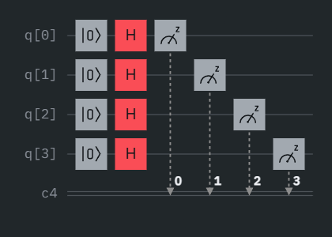

# QuantumSecureRNG

QuantumSecureRNG is a Python project that demonstrates quantum-secure cryptography by fetching true random numbers from IBM Quantum jobs and using them for cryptographic key generation and encryption.

## How It Works

1. **Fetch Quantum Randomness**
   - Uses IBM Quantum's Qiskit Runtime to retrieve measurement results from a completed quantum job (specified by `JOB_ID`).
   - Extracts random bitstrings from the quantum job result.

2. **Key Derivation**
   - Derives a cryptographic key from the quantum-generated random bits using SHA-256.

3. **Encryption**
   - Encrypts a message using the derived quantum-secure key with AES encryption.

## Main Components

- `main.py`: Entry point. Fetches quantum randomness, derives a key, and encrypts a sample message.
- `quantum/qrng.py`: Contains logic to interface with IBM Quantum and extract random bits from a quantum job.
- `crypto/key_manager.py`: Handles key derivation from quantum bits.
- `crypto/aes_cipher.py`: Performs AES encryption.

## IBM Quantum Platform

This project uses quantum circuits executed on IBM Quantum's cloud platform. The quantum random number generation relies on the fundamental probabilistic nature of quantum measurements.

### Quantum Circuit Design

The circuit implements a quantum random number generator (QRNG) using Hadamard gates to create superposition states:

```
// Add your QASM code here
OPENQASM 2.0;
include "qelib1.inc";

qreg q[5];
creg c[5];

h q[0];
h q[1];
h q[2];
h q[3];
h q[4];

measure q[0] -> c[0];
measure q[1] -> c[1];
measure q[2] -> c[2];
measure q[3] -> c[3];
measure q[4] -> c[4];
```

### Probability Distribution

The circuit produces truly random outcomes with approximately equal probability for each possible bitstring (2^n possible outcomes for n qubits).

**Example Measurement Results:**
- Expected probability per outcome: ~1/32 (for 5 qubits)
- Distribution follows quantum mechanics principles, not pseudo-random algorithms

### Circuit Visualization




## Setup

1. **Install Dependencies**
   - Python 3.8+
   - Install required packages:
     ```bash
     pip install qiskit qiskit-ibm-runtime python-dotenv
     ```

2. **IBM Quantum API Key**
   - Get your API key from https://quantum-computing.ibm.com/account
   - Save your account using Python:
     ```python
     from qiskit_ibm_runtime import QiskitRuntimeService
     QiskitRuntimeService.save_account(channel="ibm_quantum", token="YOUR_API_KEY")
     ```

3. **Configure JOB_ID**
   - Set the `JOB_ID` variable in `main.py` to the ID of a completed IBM Quantum job containing measurement results.
   - You can find your job IDs in the IBM Quantum dashboard under "Jobs"

## Usage

Run the main script:
```bash
python main.py
```

## Output
- Fetches quantum randomness from IBM Quantum.
- Derives a cryptographic key from the quantum bits.
- Encrypts a sample message and prints confirmation.

## Example Output

```
Fetching quantum randomness from job: cj8x9y2z3...
Retrieved 1024 random bits from quantum measurements
Derived 256-bit encryption key from quantum entropy
Message encrypted successfully using quantum-secure key
```

## Notes for Developers
- The code is modular and can be extended to use different quantum jobs or encryption schemes.
- Error handling for result formats is included in `quantum/qrng.py`.
- For reference or integration with other AI agents, see the structure and flow in `main.py` and `quantum/qrng.py`.
- Quantum randomness provides true entropy, superior to classical pseudo-random number generators for cryptographic applications.

## Security Considerations

- **Quantum Entropy:** The randomness comes from quantum measurements, providing true unpredictability.
- **API Key Security:** Never commit your IBM Quantum API token to version control.
- **Key Storage:** Implement secure key storage mechanisms for production use.

## Resources

- [IBM Quantum Documentation](https://docs.quantum.ibm.com/)
- [Qiskit Documentation](https://qiskit.org/documentation/)
- [Quantum Random Number Generation](https://en.wikipedia.org/wiki/Hardware_random_number_generator#Quantum_random_number_generators)

## License

[Add your license here]

## Contributing


Contributions are welcome! Please feel free to submit pull requests or open issues for improvements.
